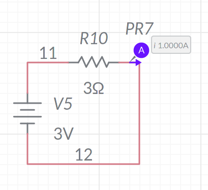

# Universidad Galileo
### Estuardo Ramos 

En el siguiente documento se detalla los problemas planteados en la practica 1 solicitado en el curso de Electronica Basica, tomar en cuenta que los codigos de componentes se cambiaron para poder ejecutarse desde un solo proyecto multisim, el cual se puede consultar [aqui](https://www.multisim.com/content/YKZtSwFv4Kcqyaz5yAX7S2/elec-practica1/open/).

## Problema 1
Los valores de $R_T$, $R_1$ y $R_2$ serian 6, 4 y 2 ohmios respectivamente segun el siguiente razonamiento
$$
R_T = \frac{V_T}{I} = \frac{6}{1} = 6 \Omega \\
R_2 = \frac{V_2}{I} = \frac{2}{1} = 2 \Omega \\
R_3 = R_T - R_2 = 6 - 2 = 4 \Omega
$$

## Problema 2
Los valores de $R_T$, $R_3$ y $R_4$ son $\frac{20}{9}$, 4 y 5 ohmios respectivamente, bajo el siguiente razonamiento
$$
4.5A = \frac{9}{2}A \\
R_T = \frac{V}{I_T} = \frac{10}{\frac{9}{2}} = \frac{20}{9} \Omega \\
R_4 = \frac{V}{I_4} = \frac{10}{2} = 5 \Omega \\
$$

$$
\frac{20}{9} = \frac{1}{\frac{1}{R_3} + \frac{1}{5}} \\
\frac{9}{20} = \frac{1}{R_3} + \frac{1}{5} \\
\frac{9}{20} - \frac{1}{5} = \frac{1}{R_3} \\
\frac{5}{20} = \frac{1}{4} = \frac{1}{R_3} \\
R_3 = 4 \Omega
$$

## Problema 3
Para este problema se creo el siguiente circutio:

Posteriormente se analiza un nuevo circuito equivalente al anterior, donde $R_5 => R_8$ y $R_9 => (R_6,R_7)$, segun el siguiente planteamiento:
$$
R_9 = \frac{1}{\frac{1}{R_6} + \frac{1}{R_7}}
$$

De igual forma se analiza un ultimo circuito equivalente donde $R_{10} => (R_8,R_9)$, debido al la suma del valor de ohmios de cada resistencia.

